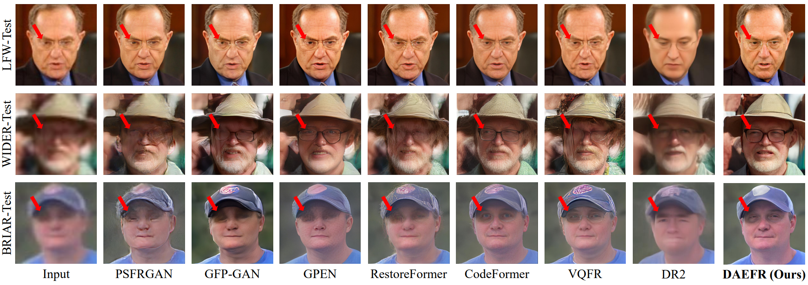
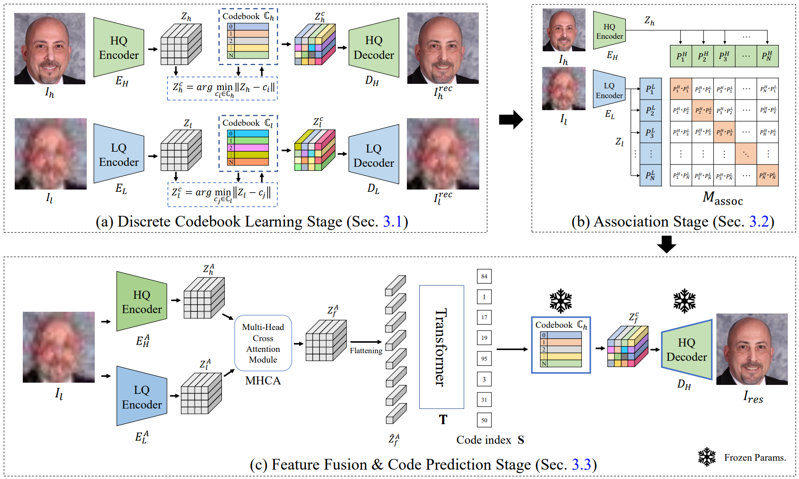

# News  ✨ ✨ 
<!-- - **20230915** Update an online demo [](https://huggingface.co/spaces/wzhouxiff/RestoreFormerPlusPlus)
- **20230116** For convenience, we further upload the [test datasets](#testset), including CelebA (both HQ and LQ data), LFW-Test, CelebChild-Test, and Webphoto-Test, to OneDrive and BaiduYun.
- **20221003** We provide the link of the [test datasets](#testset).
- **20220924** We add the code for [**metrics**](#metrics) in scripts/metrics. -->
- **[2024-01-16]** Our paper is accepted by **ICLR 2024**.
- **[2023-12-26]** Create project.


# DAEFR

This repo includes the source code of the paper: "[Dual Associated Encoder for Face Restoration](https://arxiv.org/abs/2308.07314)" by [Yu-Ju Tsai](https://liagm.github.io/), [Yu-Lun Liu](https://yulunalexliu.github.io/), [Lu Qi](https://luqi.info/), [Kelvin C.K. Chan](https://ckkelvinchan.github.io/), and [Ming-Hsuan Yang](https://faculty.ucmerced.edu/mhyang/).



We propose a novel dual-branch framework named **DAEFR**. Our method introduces an auxiliary LQ branch that extracts crucial information from the LQ inputs. Additionally, we incorporate association training to promote effective synergy between the two branches, enhancing code prediction and output quality. We evaluate the effectiveness of DAEFR on both synthetic and real-world datasets, demonstrating its superior performance in restoring facial details.



## Environment

- python>=3.8
- pytorch>=1.10.1
- pytorch-lightning==1.0.8
- omegaconf==2.0.0
- basicsr==1.3.3.4

You can also set up the environment by the following command:
```shell
conda create -n DAEFR python=3.8 -y
conda activate DAEFR
conda install pytorch==1.12.0 torchvision==0.13.0 cudatoolkit=11.3 -c pytorch -y
pip install -r requirements.txt
```

**Warning** Different versions of pytorch-lightning and omegaconf may lead to errors or different results.

## Preparations of dataset and models

**Training Dataset**: 
- Training data: **HQ Codebook**, **LQ Codebook** and **DAEFR** are trained with **FFHQ** which attained from [FFHQ repository](https://github.com/NVlabs/ffhq-dataset). 
- The original size of the images in FFHQ are 1024x1024. We resize them to 512x512 with bilinear interpolation in our work. 
- We provide our resized 512x512 FFHQ on [HuggingFace](https://huggingface.co/datasets/LIAGM/FFHQ_datasets/tree/main). Link this 512x512 version dataset to ./datasets/FFHQ/image512x512.

**Testing Dataset**: 
   <!-- * CelebA-Test-HQ: [HuggingFace](https://huggingface.co/datasets/LIAGM/DAEFR_test_datasets/blob/main/celeba_512_validation.zip);
   * CelebA-Test-LQ: [HuggingFace](https://huggingface.co/datasets/LIAGM/DAEFR_test_datasets/blob/main/self_celeba_512_v2.zip);
   * LFW-Test: [HuggingFace](https://huggingface.co/datasets/LIAGM/DAEFR_test_datasets/blob/main/lfw_cropped_faces.zip);
   * WIDER-Test: [HuggingFace](https://huggingface.co/datasets/LIAGM/DAEFR_test_datasets/blob/main/Wider-Test.zip); -->
<table>
<tr>
    <th>Datasets</th>
    <th>Short Description</th>
    <th>Download</th>
    <th>DAEFR results</th>
</tr>
<tr>
    <td>CelebA-Test (HQ)</td>
    <td>3000 (HQ) ground truth images for evaluation</td>
    <td><a href="https://huggingface.co/datasets/LIAGM/DAEFR_test_datasets/blob/main/celeba_512_validation.zip">celeba_512_validation.zip</a></td>
    <td>None</td>
</tr>
<tr>
    <td>CelebA-Test (LQ)</td>
    <td>3000 (LQ) synthetic images for testing</td>
    <td><a href="https://huggingface.co/datasets/LIAGM/DAEFR_test_datasets/blob/main/self_celeba_512_v2.zip">self_celeba_512_v2.zip</a></td>
    <td><a href="https://huggingface.co/datasets/LIAGM/DAEFR_results/blob/main/DAEFR_celeba.zip">Link</a></td>
</tr>  
<tr>
    <td>LFW-Test (LQ)</td>
    <td>1711 real-world images for testing</td>
    <td><a href="https://huggingface.co/datasets/LIAGM/DAEFR_test_datasets/blob/main/lfw_cropped_faces.zip">lfw_cropped_faces.zip</a></td>
    <td><a href="https://huggingface.co/datasets/LIAGM/DAEFR_results/blob/main/DAEFR_lfw.zip">Link</a></td>
</tr>
<tr>
    <td>WIDER-Test (LQ)</td>
    <td>970 real-world images for testing</td>
    <td><a href="https://huggingface.co/datasets/LIAGM/DAEFR_test_datasets/blob/main/Wider-Test.zip">Wider-Test.zip</a></td>
    <td><a href="https://huggingface.co/datasets/LIAGM/DAEFR_results/blob/main/DAEFR_wider.zip">Link</a></td>
</tr>
</table>

---

**Model**: Pretrained models used for training and the trained model of our DAEFR can be attained from [HuggingFace](https://huggingface.co/LIAGM/DAEFR_pretrain_model/tree/main). Link these models to ./experiments.

You can use the following command to download the model:
```shell
python download_model_from_huggingface.py
```


Make sure the models are stored as follows:
```
experiments/
|-- HQ_codebook.ckpt
|-- LQ_codebook.ckpt
|-- Association_stage.ckpt
|-- DAEFR_model.ckpt
|-- pretrained_models/
    |-- FFHQ_eye_mouth_landmarks_512.pth
    |-- arcface_resnet18.pth    
    |-- inception_FFHQ_512-f7b384ab.pth
    |-- lpips/
        |-- vgg.pth

```

## Test
    sh scripts/test.sh
Or you can use the following command for testing:
```
CUDA_VISIBLE_DEVICES=$GPU python -u scripts/test.py \
--outdir $outdir \
-r $checkpoint \
-c $config \
--test_path $align_test_path \
--aligned
```

## Training
### First stage for codebooks
    sh scripts/run_HQ_codebook_training.sh
    sh scripts/run_LQ_codebook_training.sh
### Second stage for Association
    sh scripts/run_association_stage_training.sh
### Final stage for DAEFR
    sh scripts/run_DAEFR_training.sh

**Note**. 
- Please modify the related paths to your own.
- The second stage is for model association. You need to add your trained HQ\_Codebook and LQ\_Codebook model to `ckpt_path_HQ` and `ckpt_path_LQ` in config/Association_stage.yaml.
- The final stage is for face restoration. You need to add your trained HQ\_Codebook and Association model to `ckpt_path_HQ` and `ckpt_path_LQ` in config/DAEFR.yaml.
- Our model is trained with 8 A100 40GB GPUs with batchsize 4.

## <a id="metrics">Metrics</a>
    sh scripts/metrics/run.sh
    
**Note**. 
- You need to add the path of CelebA-Test dataset in the script if you want get IDA, PSNR, SSIM, LPIPS. You also need to modify the name of restored folders for evaluation.
- For LMD and NIQE, we use the evaluation code from [VQFR](https://github.com/TencentARC/VQFR). Please refer to their repo for more details.

## Citation
    @inproceedings{tsai2024dual,
        title={Dual Associated Encoder for Face Restoration},
        author={Tsai, Yu-Ju and Liu, Yu-Lun and Qi, Lu and Chan, Kelvin CK and Yang, Ming-Hsuan},
        booktitle={The Twelfth International Conference on Learning Representations},
        year={2024}
    }

## Acknowledgement
We thank everyone who makes their code and models available, especially [Taming Transformer](https://github.com/CompVis/taming-transformers), [basicsr](https://github.com/XPixelGroup/BasicSR), [RestoreFormer](https://github.com/wzhouxiff/RestoreFormer), [CodeFormer](https://github.com/sczhou/CodeFormer), and [VQFR](https://github.com/TencentARC/VQFR).

## Contact
For any question, feel free to email `louis19950117@gmail.com`.